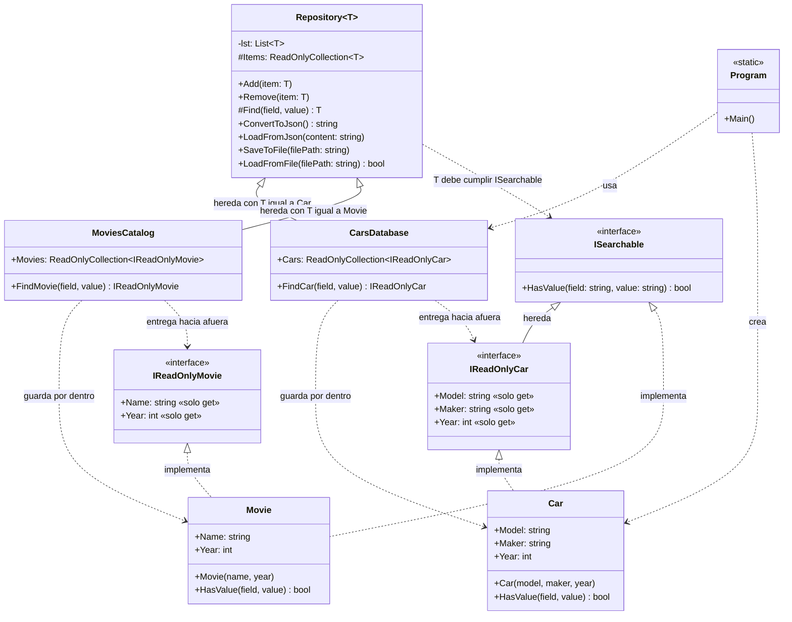

# Tarjetas CRC y diagrama UML

CRC = **C**lase, **R**esponsabilidades, **C**olaboradores. Cada tarjeta
responde tres preguntas: *¿qué es?*, *¿qué sabe y qué hace?* y *¿con quién
trabaja para hacerlo?*

Debajo de cada tarjeta hay un espacio para que lo escribas **con tus
palabras**. La idea no es copiar lo de arriba: es comprobar si podés explicarlo
sin mirarlo. Lo que no puedas escribir sin mirar es lo que todavía no entendés.

---

## 1. Diagrama UML de clases

Se ve renderizado en GitHub o en VS Code (vista previa de Markdown con la
extensión *Markdown Preview Mermaid Support*).

**Cómo leerlo**

| Flecha | Significa |
|---|---|
| `<|--` (línea llena, triángulo) | herencia entre clases (o entre interfaces) |
| `<|..` (línea punteada, triángulo) | una clase implementa una interfaz |
| `..>` (línea punteada, flecha) | "usa" o "depende de" |

**Visibilidad:** `+` público, `#` protegido, `-` privado.

### Mis notas sobre el diagrama

Contestá sin mirar el código:

1. ¿Por qué `CarsDatabase` tiene flechas hacia `Car` **y** hacia `IReadOnlyCar`?

   ______________________________________________________________________
    Porque CarsDataBase es una colección de Car y a su vez de IReadOnlyCar mediante una asociación rígida.
   ______________________________________________________________________

2. ¿Por qué `Repository` tiene una flecha hacia `ISearchable` y no hacia `Car`?

   ______________________________________________________________________
    Repository es una colección genérica de cualquier tipo de objetos (no solamente de car), cuyos objetos son todos de tipo ISearchable.
   ______________________________________________________________________

3. ¿Qué cambiaría en el diagrama si `Find` fuera público?

   ______________________________________________________________________
    El método Find de Repository<T> pasaría de (#) a (+) y los métodos FindCar y FindMovie ya no existirían. Devolvería un Car mutable.
   ______________________________________________________________________

4. Dibujá acá (a mano o en texto) cómo agregarías una clase nueva, por ejemplo
   `Book`, con su `IReadOnlyBook` y su `BooksLibrary`:

   ______________________________________________________________________
    La clase Book la agregaría con sus correspondientes métodos y atributos, implementando IReadOnlyBook y ISearchable. BooksLibrary hereda Repository<Book> y se asocia con Book y con IReadOnlyBook. BooksLibrary agrega Books y FindBook, que entregan los libros como IReadOnlyBook.
   ______________________________________________________________________

   ______________________________________________________________________

---

## 2. Quién ve qué (visibilidad)

Esta tabla es el corazón de la encapsulación del ejercicio.

| Miembro | Dónde está | Visibilidad | ¿Lo ve el `Program`? | Devuelve |
|---|---|---|---|---|
| `lst` | `Repository<T>` | privado | No | (lista real de `T`) |
| `Items` | `Repository<T>` | protegido | No | `ReadOnlyCollection<T>` |
| `Find` | `Repository<T>` | protegido | No | `T` |
| `Add`, `Remove` | `Repository<T>` | público | Sí | — |
| `ConvertToJson`, `LoadFromJson`, `SaveToFile`, `LoadFromFile` | `Repository<T>` | público | Sí | — |
| `Cars` | `CarsDatabase` | público | Sí | `ReadOnlyCollection<IReadOnlyCar>` |
| `FindCar` | `CarsDatabase` | público | Sí | `IReadOnlyCar` |
| `Movies` | `MoviesCatalog` | público | Sí | `ReadOnlyCollection<IReadOnlyMovie>` |
| `FindMovie` | `MoviesCatalog` | público | Sí | `IReadOnlyMovie` |

**Regla que resume todo:** lo que **entra** (`Add`) usa el tipo completo
(`Car`); lo que **sale** (`Cars`, `FindCar`) usa el tipo de solo lectura
(`IReadOnlyCar`).

### Mis notas sobre la tabla

¿Por qué `Items` y `Find` son protegidos y no privados? (Pista: ¿quién más los
necesita?)

______________________________________________________________________

______________________________________________________________________

---

## 3. Tarjetas CRC

### Tarjeta 1: `ISearchable` (interfaz)

| Responsabilidades | Colaboradores |
|---|---|
| Declarar que un objeto puede decir si tiene un valor para un atributo (`HasValue`). No tiene código: es solo un contrato. | `Repository<T>` (lo exige con `where T : ISearchable`), `Car` y `Movie` (lo cumplen) |

**Mis notas:** ¿qué problema resuelve esta interfaz? ¿Qué pasaba sin ella?

______________________________________________________________________
    Esta interfaz resuelve el problema de que la clase genérica Repository<T> pueda implementar el método Find sobre el objeto en cuestión, que tiene su propio método HasValue, ya que el objeto es cuestión es de tipo ISearchable que declara HasValue.
    Sin ella, la clase genérica no puede compilar el método Find ya que los objetos en cuestión no garantizan que tengan el método HasValue que necesita Find.
______________________________________________________________________

______________________________________________________________________

---

### Tarjeta 2: `IReadOnlyCar` (interfaz)

| Responsabilidades | Colaboradores |
|---|---|
| Declarar los datos de un auto que se pueden **leer** (`Model`, `Maker`, `Year`), sin `set`. Heredar `HasValue` de `ISearchable`. | `Car` (la implementa), `CarsDatabase` (la usa como tipo de salida), `ISearchable` (hereda de ella) |

**Mis notas:** si `Car` la implementa, ¿por qué un `Car` sigue teniendo `set`?

______________________________________________________________________  
    Que Car implemente IReadOnlyCar significa que debe tener todas las operaciones de la interfaz para ser subtipo pero, además puede tener otras, como por ejemplos propiedades set para sus atributos. Estos set quedan ocultos cuando el objeto se mira a través de IReadOnlyCar.
______________________________________________________________________
______________________________________________________________________

---

### Tarjeta 3: `IReadOnlyMovie` (interfaz)

| Responsabilidades | Colaboradores |
|---|---|
| Declarar los datos de una película que se pueden **leer** (`Name`, `Year`), sin `set`. | `Movie` (la implementa), `MoviesCatalog` (la usa como tipo de salida) |

**Mis notas:** ¿en qué se parece y en qué se diferencia de `IReadOnlyCar`?

______________________________________________________________________
    Se parecen en el punto de que ambas interfaces declaran las propiedades que contiene cada subtipo Car y Movie con get pero sin set, y se usan como el tipo que se muestra hacia afuera. Se diferencian en el punto de que los atributos para Car y Movie no son exactamente los mismos y por lo tanto cada una de las clases necesitan interfaces respectivas.
______________________________________________________________________

______________________________________________________________________

---

### Tarjeta 4: `Car`

| Responsabilidades | Colaboradores |
|---|---|
| Guardar modelo, fabricante y año de un auto. Permitir modificarlos (tiene `set`). Responder `HasValue(field, value)`. | `IReadOnlyCar` (la implementa), `ISearchable` (a través de `IReadOnlyCar`), `CarsDatabase` (la guarda) |

**Mis notas:** ¿desde dónde se puede modificar un `Car` y desde dónde no?

______________________________________________________________________
    Un Car no se puede modificar desde los resultados que arroja el método .FindCar y la propiedad .Cars
    Un Car se puede modificar desde Program cuando creo una nueva instancia de Car, desde dentro de CarDatabase con la propiedad Items ya que la misma estrega una lista de Cars con propiedades con set.
    En los tres casos lo que decide es el tipo con el que se ve el objeto: con Car se puede modificar; con IReadOnlyCar, no.
______________________________________________________________________

______________________________________________________________________

---

### Tarjeta 5: `Movie`

| Responsabilidades | Colaboradores |
|---|---|
| Guardar nombre y año de una película. Permitir modificarlos. Responder `HasValue(field, value)`. | `IReadOnlyMovie` e `ISearchable` (las implementa), `MoviesCatalog` (la guarda) |

**Mis notas:** ¿por qué `Car` y `Movie` siguen teniendo su propio `HasValue` y no
se movió a `Repository<T>`?

______________________________________________________________________
    Porque HasValue evalúa según los atributos específicos que tiene una clase Car y que tiene una clase Movie, que no son los mismos para cada clase.
______________________________________________________________________

______________________________________________________________________

---

### Tarjeta 6: `Repository<T>` (clase genérica)

| Responsabilidades | Colaboradores |
|---|---|
| Guardar una lista de elementos de tipo `T`. Agregar (ignorando `null`) y quitar elementos. Buscar un elemento por atributo y valor (`Find`, protegido). Dar a las subclases una vista de solo lectura de la lista (`Items`, protegido). Convertir a JSON y cargar desde JSON. Guardar en archivo y cargar desde archivo. | `ISearchable` (`T` debe cumplirlo, para poder llamar a `HasValue`), `CarsDatabase` y `MoviesCatalog` (heredan de ella), `JsonSerializer` y `File` (de .NET, para la persistencia) |

**Mis notas:** ¿qué es `T`? ¿Cuándo se sabe qué tipo es?

______________________________________________________________________
    T es el tipo genérico de una clase, un marcador de posición que se completa cuando la clase se usa. Se sabe de qué tipo es cuando otra clase la hereda y cuando se crea una nueva instancia.
______________________________________________________________________

______________________________________________________________________

¿Qué pasaría si le sacás el `where T : ISearchable`?

______________________________________________________________________
    El compilador no sabría que el tipo T genérico implementa el tipo ISearchable y por lo tanto el método Find no podría compilarse ya que el compilador no puede saber que el objeto en cuestión implementa el método HasValue.
______________________________________________________________________

---

### Tarjeta 7: `CarsDatabase`

| Responsabilidades | Colaboradores |
|---|---|
| Ser el repositorio de autos (hereda todo de `Repository<Car>`). Entregar los autos hacia afuera como `IReadOnlyCar` (`Cars`). Buscar un auto y entregarlo como `IReadOnlyCar` (`FindCar`). | `Repository<Car>` (le da `Items`, `Find`, `Add`, JSON, archivos), `Car` (lo que guarda por dentro), `IReadOnlyCar` (lo que muestra por fuera) |

**Mis notas:** ¿de dónde sale `this.Items` dentro de `Cars` si no está escrito en
esta clase?

______________________________________________________________________
     CarsDatabase hereda la clase genérica Repository<Car> y por lo tanto hereda todas sus propiedades y métodos. this.Items es la lista de solo lectura de cada Car que tiene la clase repository y que por lo tanto también existe dentro de CarsDatabase y de la propiedad Cars.
______________________________________________________________________

______________________________________________________________________

¿Quién llama a quién: `Repository` a `CarsDatabase` o `CarsDatabase` a
`Repository`? ¿Por qué?

______________________________________________________________________
    CarsDatabase llama a repository porque hereda la clase genérica. Cuando llama a las propiedad this.Items y el método this.Find.
    No puede ser al revés ya que la clase genérica no conoce a la clase que la hereda.
______________________________________________________________________

---

### Tarjeta 8: `MoviesCatalog`

| Responsabilidades | Colaboradores |
|---|---|
| Ser el repositorio de películas (hereda todo de `Repository<Movie>`). Entregar las películas hacia afuera como `IReadOnlyMovie` (`Movies`). Buscar una película y entregarla como `IReadOnlyMovie` (`FindMovie`). | `Repository<Movie>`, `Movie`, `IReadOnlyMovie` |

**Mis notas:** ¿qué código se repite entre `CarsDatabase` y `MoviesCatalog`? ¿Por
qué no se pudo evitar del todo? (Pista: ¿qué conoce `Repository<T>` y qué no?)

______________________________________________________________________
    Se repite el código de mostrar una lista de Cars/Movies con propiedad de solo lectura. Y el código de buscar un Car/Movie según el criterio también con propiedad de solo lectura.
    Esto no se evita ya que tanto la propiedad como el método de la clase genérica tienen que ser protegidos para respetar la encapsulación y por lo tanto se debe realizar la selección del tipo IReadOnly en la misma clase de CarsDatabase/MoviesCatalog. Esta conversión no la puede hacer la clase genérica ya que la misma no puede retornar un tipo específico que sea de solo lectura, ya que solo conoce T y no sabe cuál es la interfaz de solo lectura.
______________________________________________________________________

______________________________________________________________________

---

### Tarjeta 9: `Program`

| Responsabilidades | Colaboradores |
|---|---|
| Punto de entrada. Crear autos, guardarlos en una `CarsDatabase`, guardarla en `cars.json`, cargarla en otra `CarsDatabase` y mostrar los datos. | `Car`, `CarsDatabase` |

**Mis notas:** ¿qué tipo tiene cada auto cuando `Program` lo recorre con
`foreach (... in database.Cars)`? ¿Qué cambia si escribís `Car car` o
`IReadOnlyCar car`?

______________________________________________________________________
    El tipo que tiene cada auto con el foreach es de tipo IOnlyReadCar. 
    Lo que cambia entre las dos maneras de escribir el foreach es que la primera recorre database.Cars convirtiendo los objetos de la lista a tipo Car y la segunda convirtiendo los objetos a tipo IOnlyReadCar. 
______________________________________________________________________

______________________________________________________________________

---

## 4. Verificación final (sin mirar nada)

Si podés responder estas cinco preguntas en voz alta, entendiste el diseño:

1. ¿Qué problema tenían `CarsDatabase` y `MoviesCatalog` antes de la solución?
   (Son **dos** problemas.)
2. ¿Qué ahorra código: la interfaz o la clase genérica? ¿Y para qué sirve la
   interfaz entonces?
3. ¿Por qué `ReadOnlyCollection` solo no alcanzaba?
4. ¿Por qué `Repository<IReadOnlyCar>` no funciona?
5. ¿Por qué `Find` es protegido y `FindCar` es público?

Mis respuestas:
1. Antes de la solución, CarsDatabase y MoviesCatalog repetían el mismo código salvo por los tipos que se manipulan dentro de cada una de las clases. 
Además, existía el problema de que la propiedad Cars/Movies exponía la lista de autos/películas de solo lectura, pero los elementos que la lista contiene eran de tipo Car/Movie con propiedades de lectura y escritura, lo que permite modificar los atributos de cada instancia por separado "desde afuera". 
______________________________________________________________________
2. La clase genérica ahorra código al implementar todas las propiedades y métodos que van a tener las clases herederas. La interfaz declara que propiedades y métodos deben contener las clases que la implementan para poder ser utilizadas según una propiedad o método específico. La interfaz no ahorra código, solo permite clasificar a la clase que la implementa como subtipo de la interfaz y por lo tanto permite poder realizar operaciones a partir del tipo de la interfaz. En el caso del ejercicio, la clase genérica hace uso de la interfaz ISearchable para compilar su método Find, ya que los tipos T que la clase va a utilizar implementan el método HasValue.
______________________________________________________________________
3. Porque ReadOnlyCollection retorna una lista de solo lectura pero que contiene objetos de tipo Car/Movie. Los mismos contienen propiedades tanto de lectura como de escritura y eso permite que la información que contienen los objetos individualmente pueda ser manipulada.
______________________________________________________________________
4. Porque Repository<T> carga datos desde JSON con LoadFromJson, y para eso necesita crear objetos de tipo T. IReadOnlyCar es una interfaz y no se puede instanciar, así que Deserialize no podría construir los elementos. Por eso Repository guarda Car por dentro y las subclases muestran IReadOnlyCar hacia afuera.
______________________________________________________________________
5. Find es protegido porque ese método retorna un objeto Car/Movie que tiene propiedades get y set, dando el mismo problema de encapsulación. FindCar es público porque es el que se encarga de llamar el método find pero devolviendo un tipo IReadOnly en vez del tipo T en cuestión.
______________________________________________________________________

______________________________________________________________________
